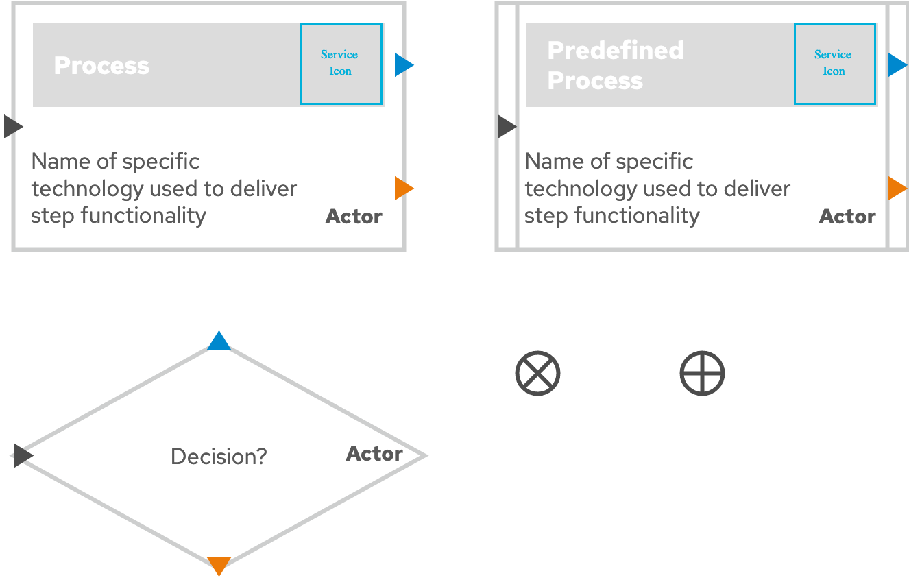

# diagrams.net Libraries

This directory contains custom libraries used by the diagrams in this repository that can be imported into diagrams.net (or any mxgraph compliant) tool.

## Local Libraries
Libraries used hosted in this project.

* [Process Diagrams](./Process&#32;Diagrams) - Components used to make process diagrams.  
  

## Remote Libraries
Libraries used hosted in other places on the internet.

* [Red Hat Portfolio Architecture Team](https://gitlab.com/redhatdemocentral/portfolio-architecture-tooling/-/tree/master/Libraries)
  * Icon Library
  * Detail Diagrams
  * Logical Diagrams
  * Schematic Diagrams
