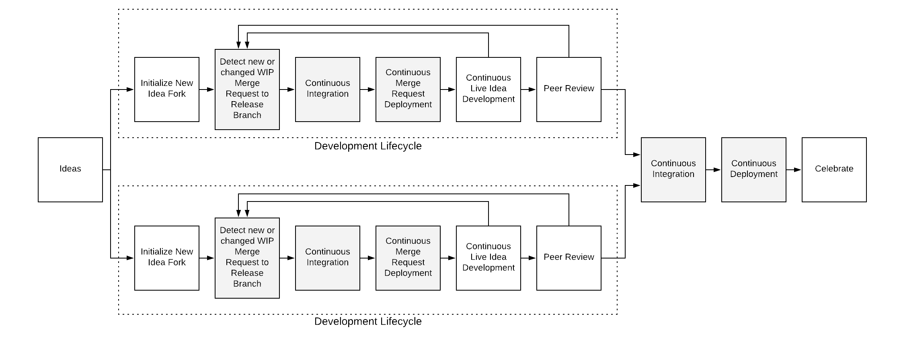

= MVP

Information about what is included in the MVP for Trusted Software Supply Chain (TSSC).

== Workflows

=== Abstract

==== Single Dev

===== Simple

===== Detailed

image::assets/single-dev-workflow-detail.png[overview of a single dev details workflow]

==== Multiple Devs

===== Simple

image::assets/multi-dev-workflow-simple.png[overview of multiple devs simple workflow]

===== Detailed

////
==== Detailed Workflow

////

=== Java (Backend)

https://www.lucidchart.com/documents/view/686183c6-821a-42a8-a71a-44dbc594de91/aG9PKqQUuCDz[LucidChart Java (Backend) TSSC]

=== JavaScript (Frontend)

https://www.lucidchart.com/documents/view/c9bb007f-3d24-4800-ab52-ad6c972752eb[LucidChart Javascript (Frontend) TSSC]

== Tooling

.Tooling by Workflow Implimentation
[cols="a,a,a",options="header"]
|===
| Purpose
2+| Tools by Workflow Type

|
h| *Java (Backend)*
h| *JavaScript (Frontend)*

| Source Control 
2+| https://github.com/go-gitea/gitea[Gitea]

| Container Orchestration
2+| Red Hat OpenShift Container Platform 4 (OCP)

| Identity Management
2+| Red Hat Single Sign-On (RH SSO) (KeyCloak)

| Artifact Repository
2+| https://jfrog.com/open-source/[JFrog Artifactory]

| Image Registry
2+| Red Hat Quay

| Continues Integration
2+|
* Jenkins
* Tekton

| Continues Deployment
2+| https://argoproj.github.io/argo-cd/[ArgoCD]

| Security Static Code Analysis
| SonarQube
| SonarQube

| Linting Satic Code Analysis
| SonarQube
| SonarQube

| Unit Testing
| Junit
|
* TBD
** Mocha?
** Jest?
** ?

| Build
| Maven
| N/A

| Static Compliance Container Image Scanning
| OpenSCAP
| OpenSCAP

| Static Vulnerability Container Image Scanning
| OpenSCAP
| OpenSCAP

| UAT
| Cucumber
| Selenium

| Runtime Vulnerability Scanning
|
* TBD
** OWASP?
|
* TBD
** OWASP?

| Canary Testing
a| Selenium
a| Selenium

| Development Workflow (IDE)
a| TBD
a| TBD
|===
